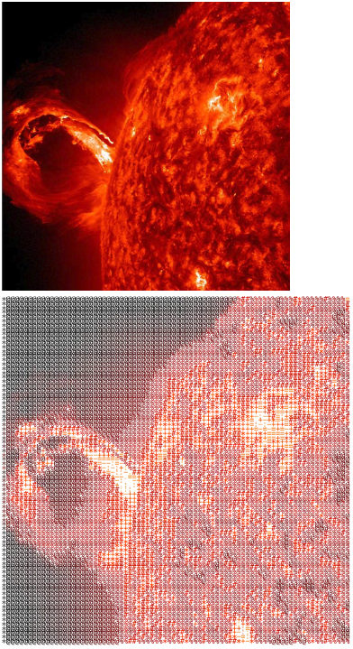

# nasascii
a ascii code art generating api local server built with express, axios, jimp and nasa image-api

## how to run

> node run start

> localhost:3000/

> localhost:3000/?planet=earth

## example

